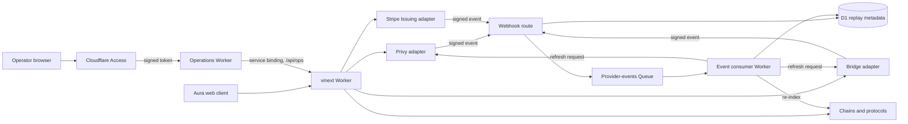

## Principle

Aura prepares, checks, and shows money movements. It is not a bank ledger. It must stay recoverable from its providers and public chains: deleting the application database must never delete customer money, change a balance, or make ownership ambiguous.

## Systems of record

| Domain | Authoritative source | What Aura may store |
| --- | --- | --- |
| Wallets and signers | Privy and the configured custody/signer arrangement | Wallet references, user labels, policy-display cache |
| Fiat accounts, KYC and transfers | Bridge | Provider object IDs, workflow state, last observed status |
| Cards and card transactions | Stripe Issuing (card, controls, authorizations, transactions, disputes) with Bridge (card approval and USDC collection); the spending allowance on Base | Which card is the customer's (`card_account_projections`), and a replaceable record of card payments as Stripe reported them for operators (`card_observations`) |
| Crypto balances and DeFi positions | Blockchains and protocol contracts | Indexed projections with chain, block, transaction, and observation metadata |
| Market value | Named market-data provider | Short-lived, timestamped price observations |

## Cloudflare platform

What the Workers bind today (`apps/*/wrangler.jsonc`):

- **Workers + Static Assets:** the web app and its API (`aurel-financial-os`), the docs (`aurel-docs`), the operations app (`aurel-ops`), and the provider-event consumer (`aurel-provider-event-consumer`).
- **D1:** one database shared by the web and events Workers: disposable projections, preferences, consent receipts, audit evidence, and idempotency records.
- **Queues:** provider events from the webhook routes to the consumer, with a dead-letter queue.
- **Cron triggers:** the web Worker every 2 minutes (re-check open actions and bank payouts, look for money received, deliver notices), the consumer every 5 minutes (reconciliation and dependency checks).
- **Service bindings:** the operations Worker reaches the web app's operator APIs directly, not over the public internet.
- **Cloudflare Access:** staff sign-in for the operations app; the web app verifies Access's signed token on every operator API request.
- **Workers Secrets:** provider and RPC credentials.

Workflows, KV, and R2 are not bound. WAF, rate-limit rules, and API Shield are planned in [edge security activation](../operations/edge-security-activation.md). D1 never decides whether customer money exists or settled.

## Runtime flow

Customer money movements follow the [money actions](money-actions.md) pipeline; signing and relay are in [accounts and custody](accounts-and-custody.md). The command path returns provider receipts. The event path refreshes read models. Neither path fabricates settlement from an Aura database write.

## Operations app

Staff use `apps/ops` (Worker `aurel-ops`, dev `aura-dev-ops`): a Vite and React page served by its own Worker (`apps/ops/src/worker.ts`). Customers never reach it, and the customer app has no operations pages.

- **Sign-in.** Cloudflare Access sits in front of the ops Worker. Only people on the Access policy get in, and Access adds its signed token in `Cf-Access-Jwt-Assertion`.
- **Forwarding.** The Worker forwards `/api/<path>` to the web app's `/api/ops/<path>` over the `WEB` service binding (`aurel-financial-os` in production, `aura-dev` in dev). It passes only the Access token and the content type and accept headers; cookies and Privy tokens stay behind. It refuses paths outside `/api/ops`.
- **Checking.** The web app doesn't trust the forwarder. `requireOperator` (`apps/web/src/lib/auth/access.ts`) verifies on every operator request: the RS256 signature against the team's keys at `<team domain>/cdn-cgi/access/certs` (cached 10 minutes; an unknown key ID refetches them at most once a minute, so forged tokens can't force a fetch per request), the issuer (the team domain), the audience (the ops application's AUD tag), expiry and not-before with 60 seconds of clock skew, and a person's email. Service tokens are refused. A customer's Privy session is never an operator.
- **Configuration.** `CF_ACCESS_TEAM_DOMAIN` and `CF_ACCESS_AUD` are web app variables, not secrets. If either is empty, every operator request is refused.
- **Audit.** Every operator change records the operator's email in `audit_events.actor_reference` and in `updated_by`, `paused_by`, or `assigned_to` on the changed row.

Operator APIs read D1 and the chain like the rest of the app. Stats come from D1 only, so they show Aura's own actions, not a ledger. Endpoints: [screen data](frontend-data.md#operations-app). Access setup: [edge security activation](../operations/edge-security-activation.md#cloudflare-access).

## Rules for application data

1. Every financial observation includes its source, external ID, status, and `observedAt`.
2. Projections are replaceable: they have schemas and rebuild jobs, not ownership.
3. A command succeeds on an authoritative provider response or chain receipt, never because Aura wrote a row.
4. Webhook receipt and idempotency state prevent duplicate work; they never create financial truth.
5. Stale or unavailable sources show as stale or unavailable, never as the previous value.
6. Sensitive provider payloads are minimized and redacted. KYC documents stay with the KYC provider.

## Recovery test

The recurring disaster-recovery exercise: erase all Aura read models, reconnect provider references, replay signed provider events, query the authoritative APIs and chains, and rebuild the same customer view. A feature that can't pass this needs an explicit exception and risk review.
