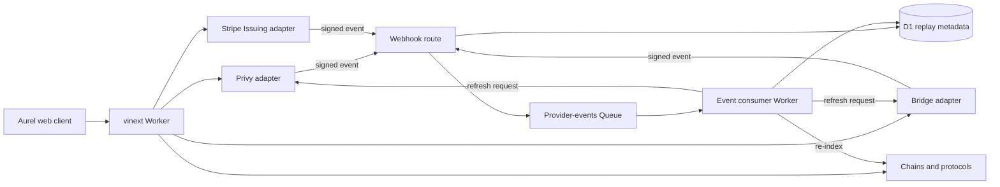

## Principle

Aurel prepares, checks, and presents money movements; it is not a bank ledger. Aurel must remain recoverable from its providers and public chains. Deleting the application database must never delete customer money, change a customer balance, or make ownership ambiguous.

## Systems of record

| Domain | Authoritative source | What Aurel may store |
| --- | --- | --- |
| Wallets and signers | Privy and the configured custody/signer arrangement | Wallet references, user labels, policy-display cache |
| Fiat accounts, KYC and transfers | Bridge | Provider object IDs, workflow state, last observed status |
| Cards and card transactions | Stripe Issuing (card, controls, authorizations, transactions, disputes) with Bridge (card approval and USDC collection); the spending allowance on Base | Which card is the customer's (`card_account_projections`); nothing else is stored |
| Crypto balances and DeFi positions | Relevant blockchain and protocol contracts | Indexed projections with chain, block, transaction, and observation metadata |
| Market value | Named market-data provider | Short-lived, timestamped price observations |

## Cloudflare platform

- **Workers + Static Assets:** web application, documentation, API, provider adapters, and webhook ingress.
- **Workflows:** resumable operations spanning user confirmation, provider callbacks, or chain finality.
- **Queues:** webhook buffering and projection refreshes when traffic warrants it.
- **D1:** optional disposable projections, preferences, consent receipts, support annotations, and idempotency records.
- **KV / Workers Cache:** feature configuration, bounded quote caching, and read-through caches.
- **R2:** optional generated exports or encrypted evidence whose canonical source remains known.
- **Workers Secrets:** provider and RPC credentials.
- **WAF, Turnstile, rate limiting, API Shield:** layered protection as the public surface expands.

The demo UI does not require a database. D1 is attached only for webhook replay protection, consent/preferences, and disposable projection jobs. It never determines whether customer money exists or settled.

## Runtime flow

Customer money movements follow the [money actions](money-actions.md) pipeline: the server prepares exact calls and builds a `wallet_sendCalls` request, the customer's browser signs a Privy authorization signature, the server relays it through Privy with gas sponsored, and the server verifies the result from chain evidence. See [accounts and custody](accounts-and-custody.md).

The command path returns provider receipts. The event path refreshes read models. Neither path fabricates settlement from an Aurel database write.

## Rules for application data

1. Every financial observation includes its source, external ID, status, and `observedAt` value.
2. Projections are replaceable. They have schemas and rebuild jobs, not data ownership semantics.
3. A command is not successful because Aurel wrote a row. Success comes from an authoritative provider response or chain receipt.
4. Webhook receipt and idempotency state prevent duplicate work; they never create financial truth.
5. Stale or unavailable sources are displayed as stale or unavailable. The UI does not silently carry a previous value forward as current.
6. Sensitive provider payloads are minimized and redacted. KYC documents should stay with the KYC provider.

## Recovery test

The recurring disaster-recovery exercise is: erase all Aurel read models, reconnect provider references, replay signed provider events, query the authoritative APIs and chains, and rebuild the same customer view. Any feature that cannot pass this test needs an explicit exception and risk review.
