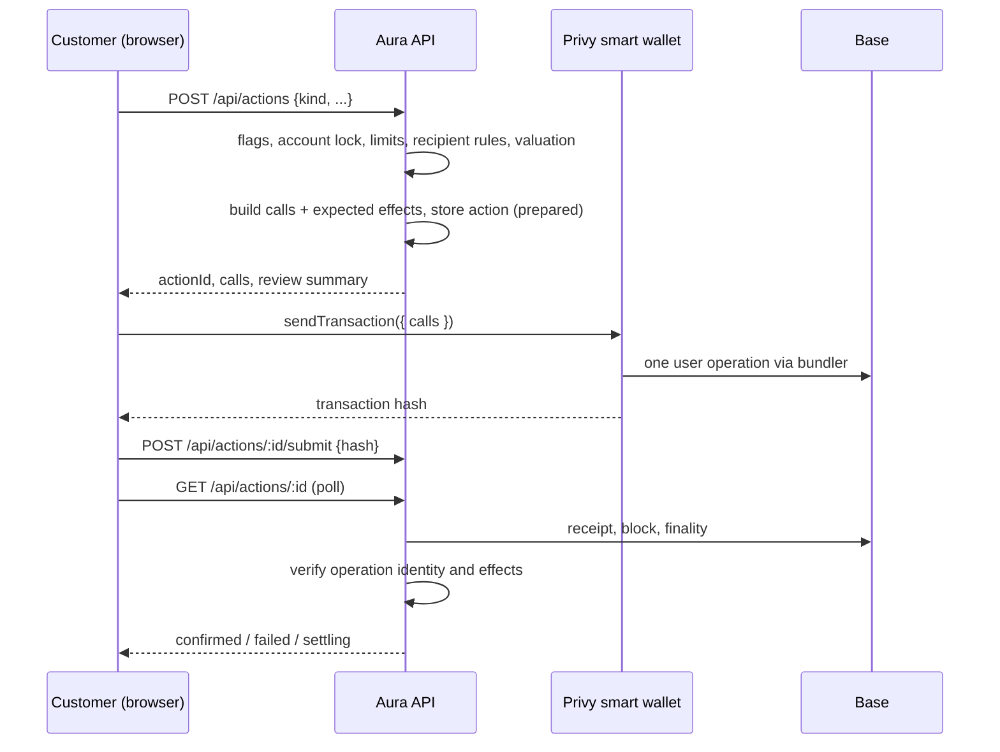

Every customer money movement is an **action**: a send, an earn deposit or withdrawal, a swap, a cross-chain deposit or withdrawal, or an invest order. All of them use one pipeline, one table, and one verifier. Provider-specific code only builds calls and describes the expected effects.

## Accounts

Each customer has a Privy smart wallet on Base, owned by their Privy embedded signer.

- Privy handles sign-in, the signer key, recovery, and export.
- The smart wallet holds funds. Its address is the customer's deposit address and the only address Aura prepares actions for.
- The embedded signer and any wallet used to log in, such as MetaMask, never hold Aura funds and are never shown as the account. Until Privy has created the smart wallet, the app shows the account as still being set up rather than falling back to another address.
- The smart wallet is deployed by its first operation. Until then a block explorer shows its address as an ordinary address with no code; that is expected.
- Adding money opens Privy's funding flow (`useFundWallet`) for USDC on Base: card, exchange, or a transfer from a connected wallet. The methods are enabled in the Privy dashboard. The address and QR code remain for sending from anywhere else.
- A paymaster sponsors gas, so customers need no ETH to act.
- An action's calls go to the smart wallet as one batch, so an approval and the action it enables are a single signature and a single onchain operation.

Configuration lives in the Privy dashboard, not in code: enable smart wallets, choose **Kernel** (ZeroDev, v3), and set the Base bundler and paymaster. Kernel is chosen because its modules can later enforce spending limits and recipient cooling onchain. Aura's verifier decodes Kernel v3 and Coinbase Smart Wallet operations; other account types are reported as unrecognized rather than guessed.

## Pipeline

1. **Prepare.** The server checks the feature switch, the account lock, the customer's limits and recipient rules, and values the action in USD. A builder returns the exact calls and the effects they must produce. The action is stored as `prepared` with a fingerprint of its calls and a short expiry.
2. **Sign.** The browser sends exactly those calls through the smart wallet. The server never signs.
3. **Submit.** The browser reports the transaction hash. The hash binds to one action only.
4. **Verify.** On each status read, the server reads the receipt independently and decides:
   - **Identity.** The transaction is an EntryPoint `handleOps` call containing an operation from the customer's smart wallet whose decoded calls equal the prepared calls, and its `UserOperationEvent` reports success.
   - **Finality.** Base: 3 confirmations and at or below the finalized block. Ethereum: 12.
   - **Effects.** Within that operation's logs, every expected effect is present: the exact ERC-20 transfer, the Aave `Supply` or `Withdraw` event, the Sky vault events, or the route's source debit and minimum output.
   - **Delivery.** Cross-chain routes stay `settling` until LI.FI reports the destination transaction and the destination receipt shows at least the minimum output reaching the customer.

A failed identity or effect check marks the action `failed` with a reason. An action whose hash never arrives expires as `expired`, which the UI shows as "not confirmed by Aura, check your wallet activity", never as failed.

D1 records are projections. A `confirmed` row reflects chain evidence Aura observed; the chain remains the authority.

## Kinds

| Kind | Builder | Calls | Effects |
| --- | --- | --- | --- |
| `transfer` | `lib/actions/transfer.ts` | ERC-20 `transfer`, or a native value call | ERC-20 `Transfer` from the wallet; native transfers rely on operation identity |
| `earn` | `lib/actions/aave.ts`, `sky.ts` | exact approve + Pool `supply`, or Pool `withdraw`; Sky equivalents | Aave `Supply`/`Withdraw` for the wallet; Sky vault events |
| `route` | `lib/actions/route.ts` | LI.FI approval (if needed) + LI.FI call | source debit of the exact amount; same-chain minimum output, or cross-chain delivery |

Swap, invest, cross-chain deposit, and cross-chain withdrawal are all `route` actions. They differ in presentation, not mechanics.

## Routes (LI.FI)

`GET /api/routes/quote` asks LI.FI for a quote with the smart wallet as sender and recipient, validates it, and stores it server-side as a `route_quote` with a short expiry. The browser receives an opaque quote ID, never raw calldata to trust.

Validation checks the assets, chains, amounts, recipient, slippage, price impact, and that the call target and approval spender are the LI.FI Diamond (`0x1231DEB6f5749EF6cE6943a275A1D3E7486F4EaE`). Aura does not decode bridge-specific calldata: outcome verification is the control. LI.FI's integrator fee is set by `LIFI_INTEGRATOR_FEE` (a fraction, default 0) with integrator `aura`.

## Limits and recipient rules

These are customer settings, off by default, stored in `security_profiles`:

- **Account lock** blocks every action.
- **Daily limit** (`daily_limit_cents`, null means none) caps the rolling 24-hour USD value of outgoing actions (transfers and routes; earn moves between the customer's own positions and does not count). If a limit is set and an action cannot be valued, it is blocked.
- **Saved recipients only** (`enforce_address_book`) blocks transfers to unsaved addresses.
- **New recipient cooling** (`new_address_delay_seconds`, default 4 hours) delays a newly saved address before it counts as saved.

Today these are enforced by the server on the actions it prepares. They do not stop a customer who exports their key and signs elsewhere. Onchain enforcement through a Kernel module is a separate, later feature ("Wealth protection"); the settings UI must say which kind of enforcement applies.

Bank limits come from Bridge once connected and appear beside these.

## Valuation

`lib/actions/valuation.ts` values the source amount: known stablecoins at $1 (a depeg below $1 still counts as $1), ETH and WETH from a fresh Kraken one-minute candle. Other route sources use LI.FI's quoted USD value, recorded with source `lifi:quote`. The value and its source are stored on the action.

## Data

- `actions`: one row per action. Calls, effects, and review summary are immutable after insert. Status moves forward only: `prepared` → `submitted` → `settling` → `confirmed`, or `failed` / `expired`.
- `action_events`: append-only evidence (submission, checks, delivery).
- `route_quotes`: server-held LI.FI quotes, deleted after expiry unless used by an action.

## API

| Route | Purpose |
| --- | --- |
| `POST /api/actions` | Prepare an action |
| `POST /api/actions/:id/submit` | Report the transaction hash |
| `GET /api/actions/:id` | Status; verifies on read, rate-limited |
| `GET /api/routes/quote` | Server-held LI.FI quotes |
| `GET /api/swap/assets` | Asset catalog for route pickers |
