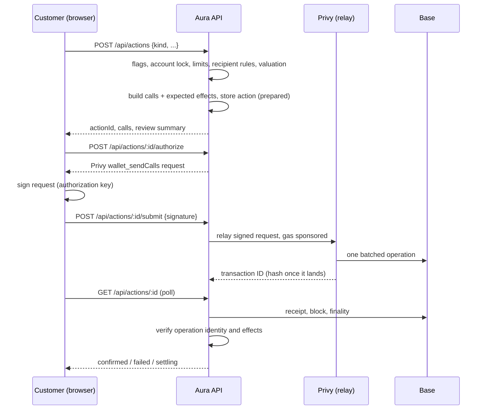

Every customer money movement is an **action**: a send, an earn deposit or withdrawal, a swap, or a cross-chain deposit or withdrawal. All use one pipeline, one table, and one verifier. Provider-specific code only builds calls and describes expected effects.

## Accounts

The account is the customer's Privy embedded wallet, with gas paid by Privy; signing, relay, keys, and leaving Privy are in [accounts and custody](accounts-and-custody.md).

- The embedded wallet holds funds. Its address is the deposit address and the only address Aura prepares actions for. A login wallet such as MetaMask never holds Aura funds and is never shown as the account.
- An action's calls go as one sponsored batch, so an approval and the action it enables are one signature and one onchain operation.
- Privy dashboard settings, not code: TEE execution and gas sponsorship (app pays) on every chain Aura sends from. The verifier decodes EntryPoint v0.6, v0.7, and v0.8 bundles with Kernel v3 or Coinbase Smart Wallet encodings; other account types are reported as unrecognized, not guessed.

### Deposit

The Deposit screen (`deposit-page.tsx`) lists four ways to add money, each opening in place (`#receive`, `#wallet`, `#card`, `#bank` open one directly): **Receive** shows the account address and QR code, with a dropdown of the assets that show in Aura on Base (the registry's `hold` use) and the warning to send only on Base; **From a wallet**; **Card**; and **Bank** (`bank-deposit-panel.tsx`, coming soon until Bridge is connected).

- **From a wallet** (`add-from-wallet.tsx`): the customer's connected wallet, such as MetaMask, with a network and asset: Base, Ethereum, Arbitrum, Optimism, or Polygon, and ETH or USDC, or EURC on Base (`lib/deposits/networks.ts`).
  - From Base it is a plain transfer.
  - From another network, `POST /api/deposits/quote` gets a LI.FI route to the same asset on Base, paid to the Aura account from a wallet Privy shows is linked to the customer. Bridge fees come out of the amount that arrives. The connected wallet signs and pays the source network fee.
  - `GET /api/deposits/status` reports LI.FI's progress (delivered, pending, refunded, or `UNKNOWN` when LI.FI can't be read or reports another transfer). The balance is read from Base.
  - Once the source transaction lands, the page sends it to `POST /api/deposits`, which keeps it in `wallet_deposits` (`lib/deposits/tracking.ts`) only if the source network shows it succeeded, went to the LI.FI Diamond, and came from a wallet Privy shows is the customer's. Transactions shows it as pending, with the quoted amount as "about", and asks LI.FI about up to three open ones per read (every 30 seconds at most); the status check above updates it too. When it arrives, the transfer on Base takes its place, labelled as from the customer's wallet. A refund or failure shows as Failed with the reason. The form is free for the next deposit while one travels.
  - A LI.FI outage or rate limit is `provider_unavailable`, never "no route". With `cross_chain` off, a quote is refused with a message and nothing is sent.
- **Card:** Privy's funding flow (`useFundWallet`), shown only while the `card_deposits` switch is on (`GET /api/deposits/methods`). Aura can only hide the way in: Privy's funding setting in its dashboard is what stops a purchase.
- Deposits are not actions: the Aura account signs nothing. The only D1 record is the `wallet_deposits` projection for bridged deposits, which never counts as a balance.

### Send

The Send screen (`wallet-workspace.tsx`) sends a registered asset with the `send` use (ETH, USDC, EURC, WETH, cbBTC, and the Coinbase stocks on Base; Tether Gold on Ethereum, where the account holds it).

- **Recipient:** an address, a saved recipient, an Aura tag, or one of the customer's linked wallets. Saved recipients, own wallets, and recent addresses are one tap. A new address can be saved with a name (`POST /api/recipients`) on confirm, and starts its waiting period. An Aura tag is checked again just before signing.
- **Network:** from `sendDestinations` in the registry: Base, or any network where the asset has the `swap` use. On Base it is a `transfer` action. Elsewhere it is a `route` action via `GET /api/routes/quote` with the recipient, which needs both `cross_chain` and `direct_transfers` and refuses token contracts. LI.FI's fees come out of the amount; the review shows estimated and minimum received and the fees; an expired quote is refreshed and shown again before anything is sent. The route is confirmed only once delivery is verified on the destination network.
- **Review:** asset, amount, recipient, and network (Aura pays the Base fee), then passkey confirmation.
- **Server checks:** refuses the customer's own Aura address and any registered token contract (`buildTransfer`), then applies the switch, lock, daily limit, saved-recipients rule, and waiting period. Without a passkey or authenticator app, the request fails with `mfa_required` and the screen opens Privy's enrollment.
- **Errors:** if Privy refuses (`relay_rejected`), the customer is told nothing was sent. If the result is unknown, they're told to check Transactions before trying again.
- Bank payouts through Bridge come later; the bank option shows as coming soon.

## Pipeline

1. **Prepare.** The server checks the switch, lock, limits, and recipient rules, and values the action in USD. A builder returns the exact calls and the effects they must produce. The action is stored as `prepared` with a fingerprint of its calls and a short expiry.
2. **Sign and submit.** The customer signs Privy's request for exactly those calls; the server relays it with gas paid, never signs, and can't change what was signed ([accounts and custody](accounts-and-custody.md#how-a-money-action-is-sent)). A transaction hash binds to one action only. Submit applies the lock, the action's switches, and its asset pauses again, whichever way it's sent.
   - **A hash the wallet reports** (`{ transactionHash }`, for a wallet that sent the calls itself; the app always relays) binds only to a `prepared` action still in its signing window, and only once the chain shows that transaction is the action's own wallet sending exactly the prepared calls (`checkReportedTransaction` in `lib/actions/verify.ts`: a plain transaction from the wallet, or exactly one EntryPoint operation whose sender is the wallet). Otherwise it's refused with `transaction_not_yours`, or `transaction_unavailable` while no endpoint has the transaction yet. Nobody can bind someone else's hash to their own action, and an expired action stays expired.
3. **Verify.** On each status read, the server reads the receipt independently:
   - **Identity.** The transaction is an EntryPoint `handleOps` call containing an operation from the customer's account whose decoded calls equal the prepared calls, and its `UserOperationEvent` reports success.
   - **Finality.** Base: included (1 confirmation) and at or below the finalized block. Ethereum: 12. Base finalizes 15 to 25 minutes after inclusion, so a fully matching included operation becomes `settling` (shown as sent for a same-chain action), then `confirmed` at finality. Nothing fails before finality: a mismatch or revert waits for the final block. The exception is a deposit into Hyperliquid through Relay or Circle's CCTP: it confirms as soon as Hyperliquid shows the credit, before Base is final ([markets](markets.md)); a failure still waits for finality.
   - **Effects.** Within that operation's logs, every expected effect is present: the exact ERC-20 transfer, the Aave `Supply` or `Withdraw` event, the Morpho vault's own `Deposit` or `Withdraw` event for the account, or the route's source debit and minimum output. Native ETH output leaves no log, so it's read from the chain instead ([native ETH output](#native-eth-output)).
   - **Delivery.** Cross-chain routes stay `settling` until LI.FI reports the destination transaction for this source transaction, on the expected network, and that transaction shows at least the minimum output reaching the recipient: a token `Transfer` in its receipt, or for ETH, the recipient's credit in its block. A route into Hyperliquid (chain 1337, not an EVM chain) is confirmed from Hyperliquid's own ledger instead: for a LI.FI route, the entry with LI.FI's destination hash must credit at least the minimum to the customer's perps balance; for a perps deposit through Circle's CCTP (`tool: "cctp"`), Circle's message for the burn must name the customer's perps balance and be forwarded, and the ledger must show the credit ([markets](markets.md)).
   - **Reads.** Each read falls back across the chain's public endpoints. publicnode refuses receipts as archive requests, so receipt reads move to the next endpoint.

### When actions are checked

- When the customer reads the action.
- When Transactions opens: up to 3 open actions not checked in the last 30 seconds.
- Every 2 minutes by the web Worker's cron (`apps/web/worker/index.ts`, `lib/actions/recheck.ts`): up to 20 submitted or settling actions not checked in the last minute, least recently checked first, one at a time. It also expires prepared actions past their signing window, checks up to 20 watched accounts for money received, and delivers up to 50 pending notices. Each of these runs on its own, so one failing doesn't stop the others.
- A check only writes over the status it read (`applyVerification`), so a slower check that started earlier can't move an action backwards or record an event twice.
- Each action is checked on its own. If one check throws, the cron counts it in `failedChecks` and moves on, and Transactions shows that action as stored. One bad action can't stop the others.

A relayed action needs its chain hash from Privy first:

- **Privy reports the relay as failed with no hash** (`failed` or `provider_error`). Privy's answer isn't chain evidence, so the action stays `submitted` and keeps being checked, with a `relay_failed` event recorded once. It fails with that reason only once the signed request's expiry (`privy-request-expiry`, the action's `expires_at`) has passed with still no hash. If Privy reports a hash meanwhile, the chain decides as usual.
- **The hash Privy reports is already linked to another action.** Nothing is attached. A `hash_in_use` event is recorded once for operators, and the action stays open (it shows in the stuck list) instead of failing every later check.

When a check moves an action to complete (a same-network action in a block and matching, or a cross-network move delivered) or failed, the customer gets one notice (`lib/notifications/store.ts` `actionNotice`), keyed by action and outcome so it never repeats. Notices use the receipt's words: the same amounts and formatting, "To" and "From", the network only when it isn't Base, and the receipt's reason when it failed ("Send failed: 25 USDC"). A bank payout is complete only when the bank has it, so its funding on Base announces nothing; `bankPayoutNotice` announces the bank's answer (arrived, or returned and why). A withdrawal from perps or predictions arriving is matched the way Transactions matches it (`labelMarketWithdrawals`) and announced as money back from Hyperliquid or Polymarket.

### Statuses

A failed identity or effect check marks the action `failed` with a reason. An action never signed and submitted becomes `expired`. Every screen maps statuses through `lib/activity/entries.ts` (`entryStatus`), as mainstream wallets do:

| Status | Shown as |
| --- | --- |
| `settling`, same network (included, fully matching, waiting only for finality) | Completed, not yet final |
| `confirmed` | Completed, final |
| `submitted`; `settling` cross-network (waiting for delivery) | Pending |
| `failed` | Failed |
| `expired` | Not sent (never failed) |

The progress panel says "complete" at that point. Base's stages: in a block in about 2 seconds (near-zero reorg probability), batch posted to Ethereum in about 2 minutes, final in about 20 minutes ([Base transaction finality](https://docs.base.org/base-chain/network-information/transaction-finality)).

D1 records are projections. A `confirmed` row reflects chain evidence Aura observed; the chain stays the authority.

## Kinds

| Kind | Builder | Calls | Effects |
| --- | --- | --- | --- |
| `transfer` | `lib/actions/transfer.ts` | ERC-20 `transfer`, or a native value call | ERC-20 `Transfer` from the wallet; native transfers rely on operation identity |
| `earn` | `lib/actions/earn.ts` (`lib/defi/aave-call-policy.ts`, `lib/defi/morpho.ts`) | Aave on Base: exact approve + Pool `supply` (USDC only; a WETH deposit refuses with `unsupported_asset`, while WETH can still be withdrawn), Pool `withdraw` of an exact amount, or Pool `withdraw` of the maximum ("Withdraw all"), after reading the account's aToken balance through `getReserveData`; nothing to withdraw refuses with `insufficient_balance`, and so does a deposit larger than the account's USDC or an exact withdrawal larger than its aToken balance, before anything is signed. Morpho vault on Base: exact USDC approve + ERC-4626 `deposit` for the account, `withdraw` of an exact amount, or `redeem` of every share ("Withdraw all"). Before building, the server re-reads the vault's `asset()` (must be USDC) and, for Vault V2, its four access gates (must be unset); otherwise it refuses with `contract_changed`. Deposits need enough USDC, withdrawals enough shares | Aave `Supply`/`Withdraw` for the wallet, for the exact amount; for Withdraw all (`aave_withdraw_all`), a `Withdraw` to the wallet of at least the balance read before signing, since interest adds to it. Morpho: the vault's `Deposit` (sender and owner = account, exact assets, plus exactly that USDC paid from the account to the vault) or `Withdraw` (sender, receiver, and owner = account, exact assets for `withdraw` or exact shares for `redeem`). A market that can't release enough liquidity reverts the withdrawal, and nothing moves |
| `route` | `lib/actions/route.ts` | LI.FI approval (if needed) + LI.FI call | Source debit of the exact amount; same-chain minimum output (`erc20_credit_min`, or `native_credit_min` for ETH), or cross-chain delivery |

The card's spending allowance is a `transfer` action built by `lib/actions/card-allowance.ts` (`POST /api/cards/allowance`): one USDC `approve` on Base to `BRIDGE_CARDS_SPENDER`, replacing any previous allowance. Its effect is an `erc20_approval`, verified from the `Approval` log (owner = account, exact spender and amount). Nothing leaves the account, so it doesn't count toward the daily limit; Transactions shows it as `card_allowance` ("Card allowance set").

**Turning card spending off** (the **Turn off** control under Spending allowance, shown while the allowance is above 0) is the same action with an amount of 0: `approve(BRIDGE_CARDS_SPENDER, 0)`. Only an `erc20_approval` effect may have `amountRaw` `"0"`; every other effect still needs a positive amount. It's confirmed only when the operation's own logs have a USDC `Approval` with owner = account, spender = `BRIDGE_CARDS_SPENDER`, and value exactly 0. It is valued at 0 and never counts toward the daily limit, so a used-up limit can't stop it, but the `payment_cards` switch, the USDC pause, the account lock, and the passkey apply as to any allowance. Its summary carries `cardAllowance.off`, and Transactions shows it as `card_spending_off` ("Card spending turned off").

Swap, cross-chain deposit, and cross-chain withdrawal are all `route` actions; they differ only in presentation.

- **Paying side.** The source must be an asset the account holds (`hold` use): Base, or Tether Gold on Ethereum. `GET /api/routes/quote` refuses anything else with `unsupported_asset`, and the pay-side dropdown lists only held assets (`GET /api/swap/assets?held=1`). A route from Ethereum is an Ethereum action, relayed and gas-sponsored like one on Base.
- **Balance.** Before asking LI.FI, `GET /api/routes/quote` reads the paying asset's balance from its chain (`requireSwapBalance` in `lib/swap/balance.ts`) and refuses more than the account holds with `insufficient_balance`, or `balance_unavailable` (503) when the read fails. Without it, an over-balance route would fail on the chain with Aura paying the network fee. The whole balance can be swapped, ETH included, since Aura pays the fee. This covers Swap and Send to another network.
- **Switches.** `GET /api/swap/assets` answers carry `switches: { sameNetwork, otherNetwork }` (`swaps`, `cross_chain`) so Swap can say it's off before a quote is asked for. The quote and the action check the switches again.
- **Price impact.** Above `MAX_PRICE_IMPACT_PERCENT` (3%), the quote is refused with `price_impact` and the lost percentage, so the customer can try less. Other failed checks are `no_route`; a LI.FI outage or rate limit is `provider_unavailable`.
- **Reference prices.** For feed-priced assets (stocks, gold, the euro), the quote includes each Chainlink reference price and its time. The review warns when the quoted price is more than 2% away.
- **Handoff.** Once a route is `settling`, the screen shows it as sent and stops holding the customer. Transactions tracks the rest.

## Routes (LI.FI)

`GET /api/routes/quote` asks LI.FI for a quote with the Aura account as sender and recipient, validates it, and stores it server-side as a `route_quote` with a short expiry. The browser gets an opaque quote ID, never raw calldata to trust.

Validation checks assets, chains, amounts, recipient, slippage, price impact, and that the call target and approval spender are the LI.FI Diamond (`0x1231DEB6f5749EF6cE6943a275A1D3E7486F4EaE`). Aura doesn't decode bridge-specific calldata: outcome verification is the control. LI.FI's integrator fee is `LIFI_INTEGRATOR_FEE` (a fraction, default 0), integrator `aura`.

### Native ETH output

A route that pays out ETH (a swap to ETH on Base, or ETH sent to another network) has no `Transfer` log to check, so `lib/actions/native-credit.ts` reads the recipient's credit from the chain, for the transaction's own block: the operation's block on the same network (effect `native_credit_min`), or, for a cross-network move, the block of the receiving transaction LI.FI reports for this source transaction (a `delivery` with `token: null`).

- **Trace first.** Where an endpoint serves `debug_traceTransaction` with `callTracer` (public endpoints usually don't; a dedicated `RPC_URL_<chainId>` may), the credit is the value of every call in that transaction that reached the recipient and didn't revert.
- **Otherwise the balance change.** The recipient's `eth_getBalance` at the block before and at the transaction's block, from an endpoint whose block hash matches the receipt's. Anything else in the same block is counted too: another incoming transfer can make a short payout look complete (accepted: the check is "at least the minimum"), and the recipient's own spending can hide a credit. So a balance shortfall is never treated as proof of failure: a same-network action stays `submitted` (`native_credit_below_minimum`), a cross-network one stays `settling`, and both show in the operators' stuck list. A traced shortfall fails like a token shortfall (`effect_missing_native_credit_min`, `delivery_below_minimum`).
- **No reading, no confirmation.** If no endpoint can trace or answer a historical balance (pruned state), the action stays open with `native_credit_unavailable`: `submitted` (shown as pending, not complete) on the same network, `settling` across networks. It is never confirmed on the debit and LI.FI's `DONE` alone.
- **Evidence.** Each reading is stored once as a `native_credit` action event: method, endpoint host, chain, transaction hash, block number and hash, recipient, credited amount, and `observedAt`. Later checks reuse it while the receipt's block hash is unchanged, so an endpoint that has since pruned that block's state doesn't hold the action back; after a reorg it is read again.
- Actions prepared before this check existed keep the effects they were stored with.

## Limits and recipient rules

Customer settings, off by default, stored in `security_profiles`. Tightening applies at once. Loosening (unlock, raise or remove the daily limit, turn off saved recipients only, shorten the wait) needs a server-verified passkey confirmation (`lib/security/step-up.ts`):

1. `PATCH /api/security/policy` answers `428 confirmation_required` with a one-time challenge and a Privy `personal_sign` request for a message naming the change.
2. The browser signs it with the customer's authorization key, which Privy unlocks with their passkey.
3. The server sends it to Privy. Only Privy's signature lets the change through (Privy refuses an invalid authorization signature).

The challenge is bound to the exact change and current policy version, expires in 5 minutes, and is single-use. Loosening also needs a passkey or authenticator app on the account (`requireMoneyMfa`).

- **Account lock** blocks every action at preparation and again at authorize and submit, so an action prepared before the lock can't be sent.
- **Switches and pauses** are checked at preparation and again at submit: turning off an action's switch or pausing its asset stops an action already prepared from being relayed (`feature_unavailable`, `asset_paused`). For a route, both the asset it spends and the asset it delivers (`summary.to.id`) are checked (`storedActionGates`).
- **Daily limit** (`daily_limit_cents`, null = none) caps the rolling 24-hour USD value of outgoing actions (transfers and routes). Earn (between the customer's own positions) and the card allowance (moves nothing) don't count. With a limit set, an action that can't be valued is blocked.
- **Saved recipients only** (`enforce_address_book`) blocks transfers to unsaved addresses.
- **New recipient cooling** (`new_address_delay_seconds`, default 4 hours) delays a newly saved address before it counts as saved. Applies only with saved recipients only on; a change doesn't move entries already saved.
- **Saved bank accounts** follow the same two rules. Adding one sets `bank_beneficiary_projections.available_at` to the customer's wait after it was added, and announces a security notice. With saved recipients only on, a payout to an account still waiting (or with no `available_at`) is refused with `recipient_cooling` before Bridge is asked (`checkBankAccount` in `lib/actions/controls.ts`). `GET /api/recipients` applies the same rule, so a waiting account shows as not ready with its `availableAt`. `DELETE /api/money/bank-accounts` deletes the account at Bridge first, then marks the row `removed` and announces it; saving it again starts a new wait.

These are enforced by the server on actions it prepares. They don't stop a customer who exports their key and signs elsewhere. Onchain or Privy-policy enforcement is a later feature ("Wealth protection"); the settings UI must say which kind applies.

Bank limits come from Bridge once connected and appear beside these. A bank payout is an ordinary USDC transfer action to the address Bridge names (`lib/actions/payout.ts`), so the lock, daily limit, and passkey apply, and the saved-recipient rules apply to the bank account. They're checked, with the `fiat_accounts` switch and the USDC pause, before Bridge is asked for the payout, and the same payout is claimed once per signing window (`command_idempotency`), so a retry returns the first action rather than creating a second Bridge payout; its bank-side progress comes from Bridge (`lib/money/bank-activity.ts`) and never changes the action's chain status.

## Valuation

`lib/actions/valuation.ts` values the source amount: known stablecoins at $1 (a depeg below $1 still counts as $1), ETH and WETH from a fresh Kraken one-minute candle. Other route sources use LI.FI's quoted USD value, with source `lifi:quote`. The value and its source are stored on the action.

## Data

- `actions`: one row per action. Calls, effects, and review summary are immutable after insert. Status moves forward only: `prepared` → `submitted` → `settling` → `confirmed`, or `failed` / `expired`.
- `action_events`: append-only evidence (submission, status changes, delivery, and `native_credit` readings). A route to another network also gets two milestones, each recorded once: `source_final` when the source transaction is final, and `delivered` when the payout is seen on the destination network. The Transactions journey (`action-journey.tsx`) is built from these.
- `route_quotes`: server-held LI.FI quotes, deleted after expiry unless used by an action. A quote makes one action: if two requests race to use it, the second gets `409 quote_used`.

## API

| Route | Purpose |
| --- | --- |
| `POST /api/actions` | Prepare an action |
| `POST /api/actions/:id/authorize` | Privy `wallet_sendCalls` request to sign |
| `POST /api/actions/:id/submit` | Relay the signed request (or report a hash from a wallet that sent the calls itself) |
| `GET /api/actions/:id` | Status; verifies on read, rate-limited |
| `GET /api/routes/quote` | Server-held LI.FI quotes |
| `GET /api/swap/assets` | Asset catalog for Swap's dropdowns, with the swap switches |
