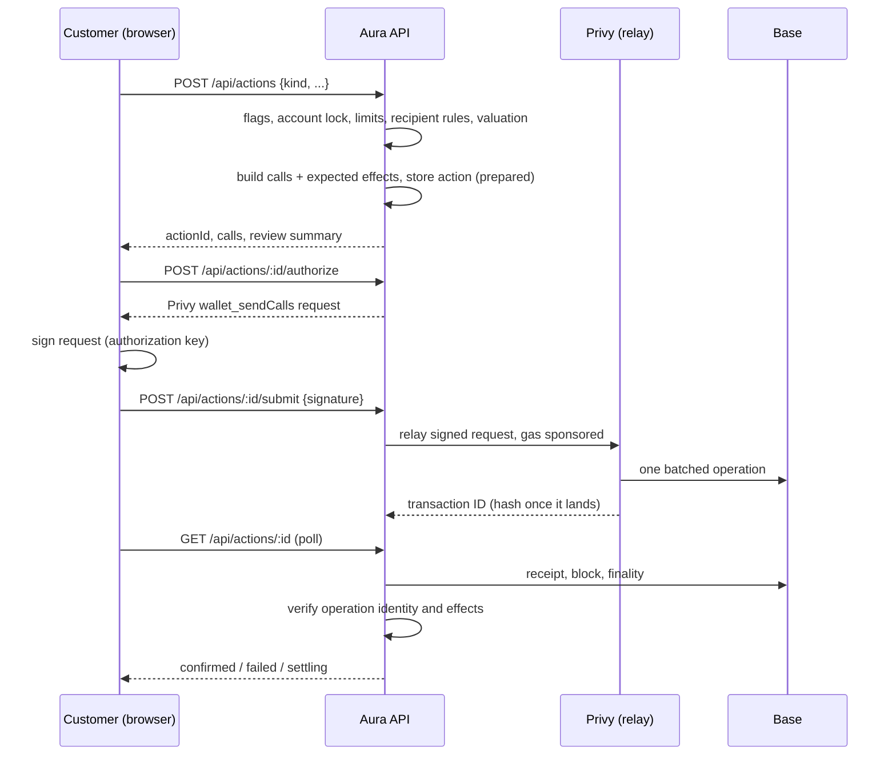

Every customer money movement is an **action**: a send, an earn deposit or withdrawal, a swap, or a cross-chain deposit or withdrawal. All use one pipeline, one table, and one verifier. Provider-specific code only builds calls and describes expected effects.

## Accounts

The account is the customer's Privy embedded wallet, with gas paid by Privy; signing, relay, keys, and leaving Privy are in [accounts and custody](accounts-and-custody.md).

- The embedded wallet holds funds. Its address is the deposit address and the only address Aura prepares actions for. A login wallet such as MetaMask never holds Aura funds and is never shown as the account.
- An action's calls go as one sponsored batch, so an approval and the action it enables are one signature and one onchain operation.
- Privy dashboard settings, not code: TEE execution and gas sponsorship (app pays) on every chain Aura sends from. The verifier decodes EntryPoint v0.6, v0.7, and v0.8 bundles with Kernel v3 or Coinbase Smart Wallet encodings; other account types are reported as unrecognized, not guessed.

### Deposit

The Deposit screen (`deposit-workspace.tsx`) shows every way to add money at once: the account address and QR code (Base only, for sending from anywhere else), the connected wallet, a card, and bank deposits (coming soon until Bridge is connected).

- **From a wallet** (`add-from-wallet.tsx`): the customer's connected wallet, such as MetaMask, with a network and asset: Base, Ethereum, Arbitrum, Optimism, or Polygon, and ETH or USDC, or EURC on Base (`lib/deposits/networks.ts`).
  - From Base it is a plain transfer.
  - From another network, `POST /api/deposits/quote` gets a LI.FI route to the same asset on Base, paid to the Aura account from a wallet Privy shows is linked to the customer. Bridge fees come out of the amount that arrives. The connected wallet signs and pays the source network fee.
  - `GET /api/deposits/status` reports LI.FI's progress (delivered, pending, refunded, or `UNKNOWN` when LI.FI can't be read or reports another transfer). The balance is read from Base.
  - A LI.FI outage or rate limit is `provider_unavailable`, never "no route". With `cross_chain` off, a quote is refused with a message and nothing is sent.
- **Card:** Privy's funding flow (`useFundWallet`).
- Deposits are not actions: the Aura account signs nothing, so nothing is stored in D1.

### Send

The Send screen (`wallet-workspace.tsx`) sends a registered asset with the `send` use (ETH, USDC, EURC, WETH, cbBTC, and the Coinbase stocks on Base; Tether Gold on Ethereum, where the account holds it).

- **Recipient:** an address, a saved recipient, an Aura tag, or one of the customer's linked wallets. Saved recipients, own wallets, and recent addresses are one tap. A new address can be saved with a name (`POST /api/recipients`) on confirm, and starts its waiting period. An Aura tag is checked again just before signing.
- **Network:** from `sendDestinations` in the registry: Base, or any network where the asset has the `swap` use. On Base it is a `transfer` action. Elsewhere it is a `route` action via `GET /api/routes/quote` with the recipient, which needs both `cross_chain` and `direct_transfers` and refuses token contracts. LI.FI's fees come out of the amount; the review shows estimated and minimum received and the fees; an expired quote is refreshed and shown again before anything is sent. The route is confirmed only once delivery is verified on the destination network.
- **Review:** asset, amount, recipient, and network (Aura pays the Base fee), then passkey confirmation.
- **Server checks:** refuses the customer's own Aura address and any registered token contract (`buildTransfer`), then applies the switch, lock, daily limit, saved-recipients rule, and waiting period. Without a passkey or authenticator app, the request fails with `mfa_required` and the screen opens Privy's enrollment.
- **Errors:** if Privy refuses (`relay_rejected`), the customer is told nothing was sent. If the result is unknown, they're told to check Transactions before trying again.
- Bank payouts through Bridge come later; the bank option shows as coming soon.

## Pipeline

1. **Prepare.** The server checks the switch, lock, limits, and recipient rules, and values the action in USD. A builder returns the exact calls and the effects they must produce. The action is stored as `prepared` with a fingerprint of its calls and a short expiry.
2. **Sign and submit.** The customer signs Privy's request for exactly those calls; the server relays it with gas paid, never signs, and can't change what was signed ([accounts and custody](accounts-and-custody.md#how-a-money-action-is-sent)). A transaction hash binds to one action only.
3. **Verify.** On each status read, the server reads the receipt independently:
   - **Identity.** The transaction is an EntryPoint `handleOps` call containing an operation from the customer's account whose decoded calls equal the prepared calls, and its `UserOperationEvent` reports success.
   - **Finality.** Base: included (1 confirmation) and at or below the finalized block. Ethereum: 12. Base finalizes 15 to 25 minutes after inclusion, so a fully matching included operation becomes `settling` (shown as sent for a same-chain action), then `confirmed` at finality. Nothing fails before finality: a mismatch or revert waits for the final block.
   - **Effects.** Within that operation's logs, every expected effect is present: the exact ERC-20 transfer, the Aave `Supply` or `Withdraw` event, the Morpho vault's own `Deposit` or `Withdraw` event for the account, or the route's source debit and minimum output.
   - **Delivery.** Cross-chain routes stay `settling` until LI.FI reports the destination transaction and its receipt shows at least the minimum output reaching the customer.
   - **Reads.** Each read falls back across the chain's public endpoints. publicnode refuses receipts as archive requests, so receipt reads move to the next endpoint.

### When actions are checked

- When the customer reads the action.
- When Transactions opens: up to 3 open actions not checked in the last 30 seconds.
- Every 2 minutes by the web Worker's cron (`apps/web/worker/index.ts`, `lib/actions/recheck.ts`): up to 20 submitted or settling actions not checked in the last minute, least recently checked first, one at a time. It also expires prepared actions past their signing window, checks up to 20 watched accounts for money received, and delivers up to 50 pending notices.

When a check moves an action to complete (a same-network action in a block and matching, or a cross-network move delivered) or failed, the customer gets one notice (`lib/notifications/store.ts` `actionNotice`), keyed by action and outcome so it never repeats.

### Statuses

A failed identity or effect check marks the action `failed` with a reason. An action never signed and submitted becomes `expired`. Every screen maps statuses through `lib/activity/entries.ts` (`entryStatus`), as mainstream wallets do:

| Status | Shown as |
| --- | --- |
| `settling`, same network (included, fully matching, waiting only for finality) | Completed, not yet final |
| `confirmed` | Completed, final |
| `submitted`; `settling` cross-network (waiting for delivery) | Pending |
| `failed` | Failed |
| `expired` | Not confirmed (never failed) |

The success toast and progress panel say "complete" at the same point. Base's stages: in a block in about 2 seconds (near-zero reorg probability), batch posted to Ethereum in about 2 minutes, final in about 20 minutes ([Base transaction finality](https://docs.base.org/base-chain/network-information/transaction-finality)).

D1 records are projections. A `confirmed` row reflects chain evidence Aura observed; the chain stays the authority.

## Kinds

| Kind | Builder | Calls | Effects |
| --- | --- | --- | --- |
| `transfer` | `lib/actions/transfer.ts` | ERC-20 `transfer`, or a native value call | ERC-20 `Transfer` from the wallet; native transfers rely on operation identity |
| `earn` | `lib/actions/earn.ts` (`lib/defi/aave-call-policy.ts`, `lib/defi/morpho.ts`) | Aave on Base: exact approve + Pool `supply`, or Pool `withdraw`. Morpho vault on Base: exact USDC approve + ERC-4626 `deposit` for the account, `withdraw` of an exact amount, or `redeem` of every share ("Withdraw all"). Before building, the server re-reads the vault's `asset()` (must be USDC) and, for Vault V2, its four access gates (must be unset); otherwise it refuses with `contract_changed`. Deposits need enough USDC, withdrawals enough shares | Aave `Supply`/`Withdraw` for the wallet. Morpho: the vault's `Deposit` (sender and owner = account, exact assets, plus exactly that USDC paid from the account to the vault) or `Withdraw` (sender, receiver, and owner = account, exact assets for `withdraw` or exact shares for `redeem`). A market that can't release enough liquidity reverts the withdrawal, and nothing moves |
| `route` | `lib/actions/route.ts` | LI.FI approval (if needed) + LI.FI call | Source debit of the exact amount; same-chain minimum output, or cross-chain delivery |

The card's spending allowance is a `transfer` action built by `lib/actions/card-allowance.ts` (`POST /api/cards/allowance`): one USDC `approve` on Base to `BRIDGE_CARDS_SPENDER`, replacing any previous allowance. Its effect is an `erc20_approval`, verified from the `Approval` log (owner = account, exact spender and amount). Nothing leaves the account, so it doesn't count toward the daily limit; Transactions shows it as `card_allowance` ("Card allowance set").

Swap, cross-chain deposit, and cross-chain withdrawal are all `route` actions; they differ only in presentation.

- **Paying side.** The source must be an asset the account holds (`hold` use): Base, or Tether Gold on Ethereum. `GET /api/routes/quote` refuses anything else with `unsupported_asset`, and the pay-side picker lists only held assets (`GET /api/swap/assets?held=1`). A route from Ethereum is an Ethereum action, relayed and gas-sponsored like one on Base.
- **Price impact.** Above `MAX_PRICE_IMPACT_PERCENT` (3%), the quote is refused with `price_impact` and the lost percentage, so the customer can try less. Other failed checks are `no_route`; a LI.FI outage or rate limit is `provider_unavailable`.
- **Reference prices.** For feed-priced assets (stocks, gold, the euro), the quote includes each Chainlink reference price and its time. The review warns when the quoted price is more than 2% away.
- **Handoff.** Once a route is `settling`, the screen shows it as sent and stops holding the customer. Transactions tracks the rest.

## Routes (LI.FI)

`GET /api/routes/quote` asks LI.FI for a quote with the Aura account as sender and recipient, validates it, and stores it server-side as a `route_quote` with a short expiry. The browser gets an opaque quote ID, never raw calldata to trust.

Validation checks assets, chains, amounts, recipient, slippage, price impact, and that the call target and approval spender are the LI.FI Diamond (`0x1231DEB6f5749EF6cE6943a275A1D3E7486F4EaE`). Aura doesn't decode bridge-specific calldata: outcome verification is the control. LI.FI's integrator fee is `LIFI_INTEGRATOR_FEE` (a fraction, default 0), integrator `aura`.

## Limits and recipient rules

Customer settings, off by default, stored in `security_profiles`. Tightening applies at once. Loosening (unlock, raise or remove the daily limit, turn off saved recipients only, shorten the wait) needs a server-verified passkey confirmation (`lib/security/step-up.ts`):

1. `PATCH /api/security/policy` answers `428 confirmation_required` with a one-time challenge and a Privy `personal_sign` request for a message naming the change.
2. The browser signs it with the customer's authorization key, which Privy unlocks with their passkey.
3. The server sends it to Privy. Only Privy's signature lets the change through (Privy refuses an invalid authorization signature).

The challenge is bound to the exact change and current policy version, expires in 5 minutes, and is single-use. Loosening also needs a passkey or authenticator app on the account (`requireMoneyMfa`).

- **Account lock** blocks every action at preparation and again at authorize and submit, so an action prepared before the lock can't be sent.
- **Daily limit** (`daily_limit_cents`, null = none) caps the rolling 24-hour USD value of outgoing actions (transfers and routes). Earn (between the customer's own positions) and the card allowance (moves nothing) don't count. With a limit set, an action that can't be valued is blocked.
- **Saved recipients only** (`enforce_address_book`) blocks transfers to unsaved addresses.
- **New recipient cooling** (`new_address_delay_seconds`, default 4 hours) delays a newly saved address before it counts as saved. Applies only with saved recipients only on; a change doesn't move entries already saved.

These are enforced by the server on actions it prepares. They don't stop a customer who exports their key and signs elsewhere. Onchain or Privy-policy enforcement is a later feature ("Wealth protection"); the settings UI must say which kind applies.

Bank limits come from Bridge once connected and appear beside these. A bank payout is an ordinary USDC transfer action to the address Bridge names (`lib/actions/payout.ts`), so the lock, daily limit, and passkey apply; its bank-side progress comes from Bridge (`lib/money/bank-activity.ts`) and never changes the action's chain status.

## Valuation

`lib/actions/valuation.ts` values the source amount: known stablecoins at $1 (a depeg below $1 still counts as $1), ETH and WETH from a fresh Kraken one-minute candle. Other route sources use LI.FI's quoted USD value, with source `lifi:quote`. The value and its source are stored on the action.

## Data

- `actions`: one row per action. Calls, effects, and review summary are immutable after insert. Status moves forward only: `prepared` → `submitted` → `settling` → `confirmed`, or `failed` / `expired`.
- `action_events`: append-only evidence (submission, status changes, delivery). A route to another network also gets two milestones, each recorded once: `source_final` when the source transaction is final, and `delivered` when the payout is seen on the destination network. The Transactions journey (`action-journey.tsx`) is built from these.
- `route_quotes`: server-held LI.FI quotes, deleted after expiry unless used by an action.

## API

| Route | Purpose |
| --- | --- |
| `POST /api/actions` | Prepare an action |
| `POST /api/actions/:id/authorize` | Privy `wallet_sendCalls` request to sign |
| `POST /api/actions/:id/submit` | Relay the signed request (or report a hash from a wallet that sent the calls itself) |
| `GET /api/actions/:id` | Status; verifies on read, rate-limited |
| `GET /api/routes/quote` | Server-held LI.FI quotes |
| `GET /api/swap/assets` | Asset catalog for route pickers |
