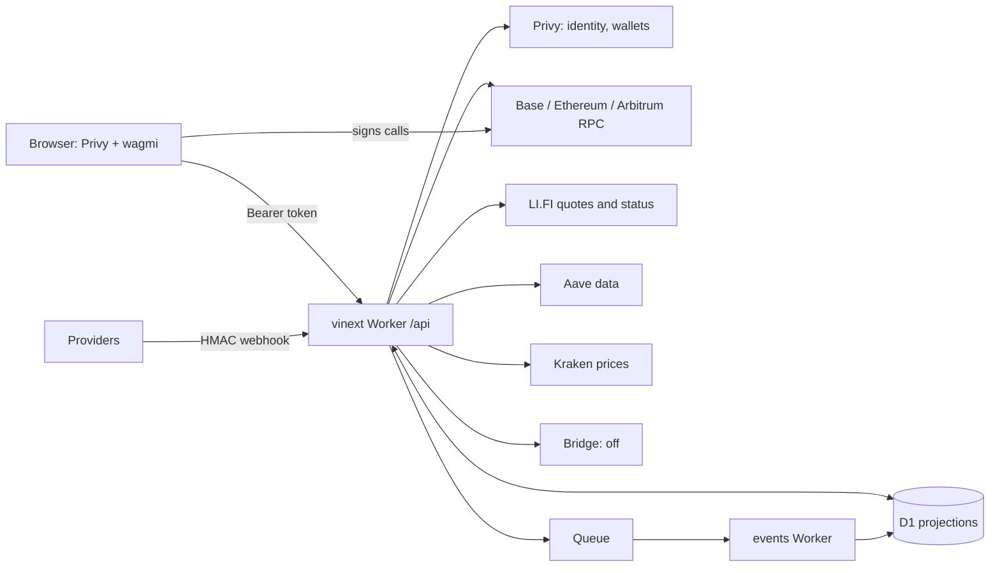

Point-in-time record. Baseline at audit time: lint and `typecheck:all` clean, 124 unit test files and 1,116 tests passing. About 14.6k lines of TypeScript in `apps/web/src` (lib about 8.1k, 59 API routes about 3.4k), 42 migrations producing 51 tables, 110 indexes, and 35 triggers.

## Decisions taken with this audit

| Decision | Consequence |
| --- | --- |
| Privy smart wallets on Base | Privy keeps auth, the embedded signer, recovery, and export. The signer owns a smart account. A paymaster sponsors gas, and approve plus action is one batched signature. Transaction checks must move from EOA transaction identity to UserOp and receipt logs. |
| Base is the home chain | Other chains are entry and exit points. Deposits from other chains are bridged in; withdrawals can bridge out. |
| One route module on LI.FI | Deposit from another chain, withdraw to another chain, swap, and invest share one quote, plan, execute, and status pipeline. Invest is a curated presentation of the same engine. |
| Compliance kept lean | Wallet sanctions screening, sanctioned-region blocking, and issuer restrictions where an issuer requires them. Nothing else until Bridge diligence asks. |
| Bank and card adapters built, switched off | Bridge and Rain adapters exist in code behind D1 feature switches, ready to turn on after approval. |
| Deferred | Borrow, perps, prediction markets, AI assistant with user data. |

## What is worth keeping

- The rules: D1 never owns money, observations carry source and `observedAt`, server-side gating, and the route wrapper (`lib/http/route.ts`) used by every route.
- Server-held quote plans and review-before-sign for swaps.
- The events Worker's stale-write guards, unknown-subject handling, and dead-letter-to-issue path.
- The backend money-flow tests (swap, Aave, Sky, intents, transfer simulation).
- `lib/http`, `lib/features`, `lib/privacy`, `lib/activity`, `lib/insights`, `lib/aura-tags.ts`, rate limiting, Turnstile, address book, audit.

## Critical findings

1. **Transaction verification assumes an EOA.** `lib/transactions/evidence.ts:48-60`, `effects.ts:64,137`, and `chain-observation.ts:60-63` match `from`, `to`, and calldata of the outer transaction. A smart-wallet UserOp is submitted by a bundler to the EntryPoint, so every smart-wallet send, swap, and Aave action would reconcile as inconsistent. This is the first thing the smart-wallet move must rewrite.
2. **D1 limits are advisory.** Signing happens in the browser (`wallet-workspace.tsx:191`, `swap-workspace.tsx:304`, `aave-action-preview.tsx:101`), so daily limits, address-book rules, and account locks in `api/intents/prepare` hold only for calls the app prepares. Enforcement must move to signing time: smart-account modules or session keys, or Privy policies where they apply.
3. **Step-up cannot complete.** `api/intents/prepare/route.ts:216,256` parks large sends in `awaiting_step_up`, and `api/security/policy/route.ts:57` refuses loosening with `step_up_unavailable`. The action-passkey code (`lib/security/action-passkey-*`, about 610 lines) is imported only by tests. A locked account cannot be unlocked and a held send never releases.
4. **Earn skips the money controls.** `api/defi/aave/action/route.ts` accepts `borrow` and checks only the account lock: no valuation, daily limit, simulation, or risk gate (`aave-risk-gate` runs only in `/preview`). `api/defi/sky/action` has the same gap.
5. **Webhook provenance is self-declared.** `api/webhooks/provider/route.ts:150-153` verifies one shared HMAC and trusts the `provider` field in the body, so the per-provider allowlist in `lib/platform/events.ts` is cosmetic. No real provider sends this envelope. `provider: "demo"` is accepted in production.
6. **Swap is hard-coded, not general.** Only Base USDC/WETH through one Uniswap pool (`swap/direct-uniswap.ts:13-19`) and Base USDC to Arbitrum or Ethereum through Across (`swap/prepare-integrity.ts:33`, `governed-across-route.ts:51`). Each bridge needs a bespoke calldata decoder (`lifi-diamond-inspection.ts`), which cannot scale to invest or cross-chain deposits.

Other findings:

- Public `api/aura-tags/[tag]` has no rate limit and calls Privy per request; tags can be enumerated and Privy quota burned. `intents/reconcile`, `intents/status`, `defi/*/receipt`, and `insights` are also unlimited.
- Bank account visibility uses the `BRIDGE_MODE` env var, not the `fiat_accounts` flag (`api/money/account/route.ts:10`): two kill switches. `api/rewards` has no flag.
- Policy constants drift: review threshold is `Number.MAX_SAFE_INTEGER` in `intents/prepare:129` and `25_000` in `swap/review:88`; the daily-spend SQL is repeated three times in `intents/prepare`.
- `lib/auth/server.ts:34` builds a `PrivyClient` per request, and `requireLinkedEvmWallet` adds a Privy lookup to most financial routes.
- Three price clients (`transactions/valuation.ts:74,131`, `portfolio/prices.ts:56`). Aave reads go through the unauthenticated `mcp.aave.com`.
- `provider_customer_links`, `bank_beneficiary_projections`, and `position_projections` are read but never written, so the bank account and tag bank details cannot appear without a manual insert.

## System map

| Flow | Path |
| --- | --- |
| Send | `intents/evaluate` (policy, valuation, intent row) → `intents/prepare` (simulation, fee budget, spend check, prepared calls) → browser signs → `intents/status` (hash) → `intents/reconcile` (observation, effects, late observation) |
| Swap and cross-chain | `swap/assets` → `swap/quote` (direct Uniswap or LI.FI, integrity check, plan) → `swap/review` (policy, intent) → `swap/prepare` + `swap/approval` → browser signs → `intents/status` → `intents/reconcile` (source, cross-source, LI.FI status, destination evidence) |
| Earn | `defi/aave/{markets,positions,preview}` → `defi/aave/action` (calls, no intent) → browser signs → `defi/aave/receipt`. Sky mirrors it. |
| Provider events | `webhooks/provider` → `webhook_receipts` + queue → `apps/events` → `provider-projections` → read by `cards`, `rewards`, `security/policy` |
| Guest browsing | `ProductAccessGate` replaces every section with `ExampleProduct` text cards |

## Verdict by area

**Backend (`apps/web/src/lib`, `api`)**

| Area | Verdict |
| --- | --- |
| `lib/swap` (2.35k lines) | Rewrite as `lib/route`: LI.FI quote → server-held plan → batched execute → LI.FI status. Cut `direct-uniswap`, `governed-across-route`, `lifi-diamond-inspection`. Merge the four effect checkers into one. |
| `lib/transactions` (1.15k) | Rewrite verification for UserOps and receipt logs; collapse evidence, chain observation, effects, and late observation into one. One price module. Keep `policy.ts`, `lifecycle.ts`. |
| `lib/portfolio` (1.49k) | Cut lots, disposals, materialize, publication, Aave history, tax support. Keep a thin overview: chain balances, positions, prices. |
| `lib/defi` (844) | Drop borrow, repay, and the risk gate/snapshot/preview (deferred). Route earn through the same intent and limits pipeline as send. |
| `lib/markets` (654) | Cut regulated orders and eligibility. Merge the xStocks list into the route catalog as the invest filter. |
| `lib/providers` (301) | Rewrite as `providers/{bridge,rain}/`, each with a flag-backed `enabled(db)`, typed commands, native webhook verification, and projection mapping. Delete demo adapters. |
| `lib/security/action-passkey-*` | Decide: finish step-up or cut it and remove the states that depend on it. |
| `api/demo`, `markets`, `money/transfers`, `support/assistant`, `portfolio/*` | Cut. |
| `api/intents`, `api/swap` | Rewrite on the new modules; one `spend.ts`. |

**Schema (`infra/d1/migrations`)**

No production database has been migrated, so squash to one baseline before production. Proposed baseline, about 24 tables: `accounts`, `account_settings`, `security_profiles`, `wallets`, `aura_tags` (tombstoned on erasure), `recipients`, `transaction_intents` (with `destination`, `asset_id`, `amount_raw`, `permitted` promoted out of JSON, CHECK constraints, foreign keys), `intent_events`, `intent_calls`, `intent_valuations`, `intent_observations`, `swap_quotes`, `positions`, `provider_customers`, `card_accounts`, three passkey tables, `feature_flags`, `consent_records` (replaces three consent tables), `data_requests`, `support_cases`, `audit_events`, `idempotency_keys`, `webhook_receipts` (absorbs `projection_refreshes`), `rate_limit_windows`, `ops_issues`, `ops_checks`.

Also: money as integer cents or raw base units everywhere (today `REAL`, `TEXT`, and decimal strings mix), ISO `Z` timestamps everywhere, one name per concept (`wallet_id`, `tx_hash`, `provider_*_id`, `asset_id`), routing policy moved from triggers to TypeScript (the triggers were rewritten in seven migrations), purge paths for idempotency, receipts, and challenges.

**Frontend (`apps/web/src/app`, `components`)**

- Guests see `ExampleProduct` text cards, not the product. Replace with one data layer that returns live or labeled example data to the same screens.
- Sections are one dynamic segment, so sub-routes such as `/app/transactions/[id]` or `/app/send/review` are impossible. Move to real routes; move operations to its own route group.
- Four hand-built sign-and-track state machines (send, swap, Aave, Sky), 25 copies of the token-fetch pattern, 8 copies of wallet selection, two modal implementations, four amount inputs. Extract `apiClient`, `useAuraWallet`, one action-flow hook, and primitives: Button, AmountInput, AssetPicker, Dialog/Sheet, DataState, StatusBadge, TransactionProgress, ExampleBanner.
- CSS is an override cascade across three files: about 223 of 533 class selectors unused, 143 classes defined twice, 273 hex literals, 24 radius values against a three-tier contract. Replace with semantic tokens plus component-scoped styles when the design system arrives.
- No signed-in e2e test and no component tests for the action flows. `tests/unit/design-system.test.ts` string-matches CSS and goes with the CSS rewrite.

**Events, scripts, CI, docs**

- Events Worker: per-provider endpoints and secrets with native verification; import the shared event type; drop `projection_refreshes`; move uptime probes out of the projection cron.
- CI builds twice (`ci.yml` runs `pnpm build`, then `test:e2e` builds again). `test:recovery` exercises SQLite backup rather than D1 recovery and breaks on a squash. `mainnet-readiness.mjs` probes unsupported chains.
- Docs: archive `docs/superpowers/**` and `operations/production-readiness-2026-09-23.md`; merge release, readiness, and acceptance plans into `overview/launch-readiness.md`; merge the three provider architecture docs and the three compliance matrices; rewrite `product/design-system.md` with the redesign.

## Refactor plan

Each step is its own branch and review, leaves CI green, and changes behavior only where stated.

1. **Cut.** Remove demo/sandbox, regulated markets, portfolio tax lots, borrow, the assistant route, dead routes and tests, and `provider: "demo"`. Archive stale docs. Fix the CI double build.
2. **Schema baseline.** Squash to the lean baseline above, rewrite migration tests to apply the baseline, rewrite or drop `test:recovery`. Reset the dev database.
3. **Smart wallet core.** Privy smart wallets with a Base paymaster; batched calls; UserOp and receipt-log verification replacing the EOA identity checks; one intent and limits pipeline for send and earn; decide step-up.
4. **Route module.** One LI.FI-backed `lib/route` behind deposit-in, withdraw-out, swap, and invest, with an integrator fee.
5. **Provider adapters.** Bridge and Rain adapters behind flags, native webhook verification, projections written by the adapters.
6. **Frontend foundation.** Real routes, data layer with example data for guests, API client and hooks, primitives and tokens from the design system. Then features, one at a time, with signed-in e2e tests.
